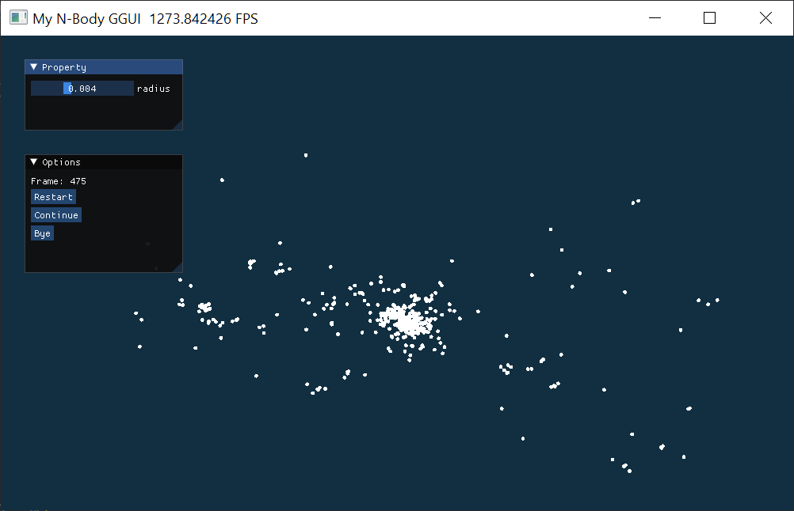

# 太极图形课S1-标题部分
小作业暂定为实现一个3D Galaxy 系统！

实现一个简单的星系系统(Galaxy)，包含基类星体(Celestial_Object)，两个子类：恒星(Star)+行星(Planet)。行星对恒星的引力忽略不计。

首先实现一个简单的二维N-Body系统，练习使用GGUI和class，将其扩展至三维，之后再在此基础上实现星系。

## 背景简介
想要好玩好看！

## 成功效果展示

## 整体结构（Optional）
```
-LICENSE
-|img  存储展示图片
-|test  存储参考和试验用的代码
-README.MD
-my_nbody.py
```

## 运行方式
相信读者们看到这里已经迫不及待想尝试了，这里标记好快速上手的方式即可~
  例如:  `python3 my_nbody.py`
