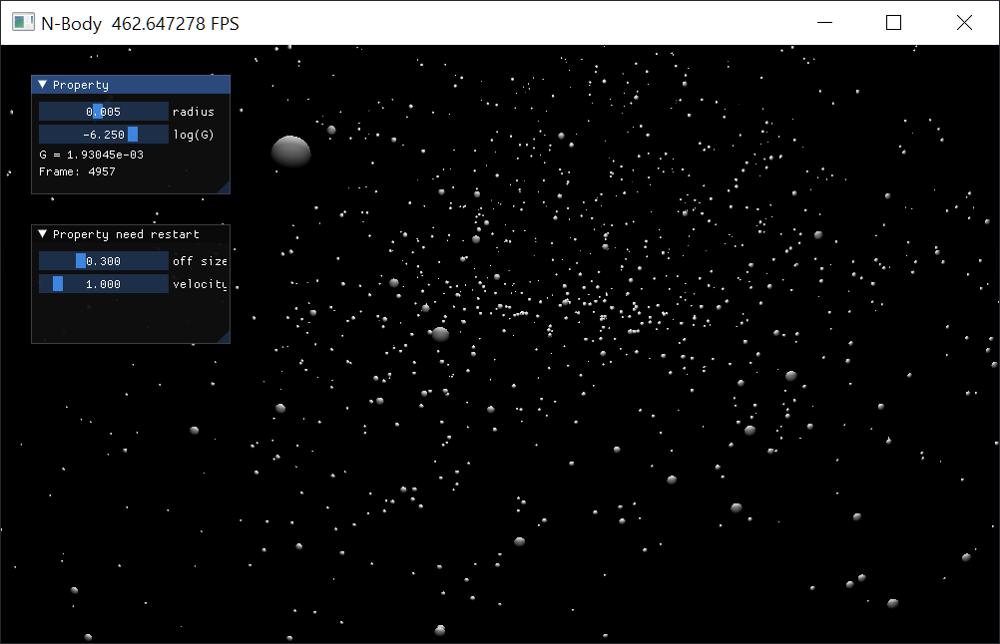

# 太极图形课S1-标题部分
小作业暂定为实现一个3D Galaxy 系统！

实现一个简单的星系系统(Galaxy)，包含基类星体(Celestial_Object)，两个子类：恒星(Star)+行星(Planet)。行星对恒星的引力忽略不计。

首先实现一个简单的二维N-Body系统，练习使用GGUI和class，将其扩展至三维，之后再在此基础上实现星系。

## 背景简介
想要好玩好看！

**阶段性目标：**
1. 创建一个维度无关的pos和pos_center，在中心点周围随机生成所有的pos坐标值 √
2. 创建一个2d的N-body系统，实现2d的计算和GGUI显示 √
3. 创建一个2d系统，加入鼠标点击后创建一团新星团的功能 ×放弃，pos ≠ pos_c？
4. 改造为2d面向对象程序 √
5. 实现3d计算，应该只需要拓展计算初速度程序的2d至3d了 ×，如何计算？参考论坛中的稳定三维三体运动作业
6. 实现3d的GGUI渲染 √
7. 3d场景如何实现交互添加新星团？
8. 改造为维度无关的面向对象程序（2d或3d自动选择执行，自动选择维度渲染及初始生成位置）

**状况**
1. 二维生成初始范围出错
2. 三维视图很不好调整
3. 三维中，canvas应该是由scene计算得到的，所以无法通过鼠标点击添加三维坐标，只能通过输入框输入三个坐标实现

## 成功效果展示

## 整体结构
```
-LICENSE
-|img  存储展示图片
-|test  存储参考和试验用的代码
-README.MD
-my_nbody.py  面向结构的初始2d程序：
-nbody_ggui.py  面向对象2d程序：
-CelestialObject.py  面向对象类文件
```

## 运行方式
`python3 my_nbody.py`
or
`python3 nbody_ggui.py`
