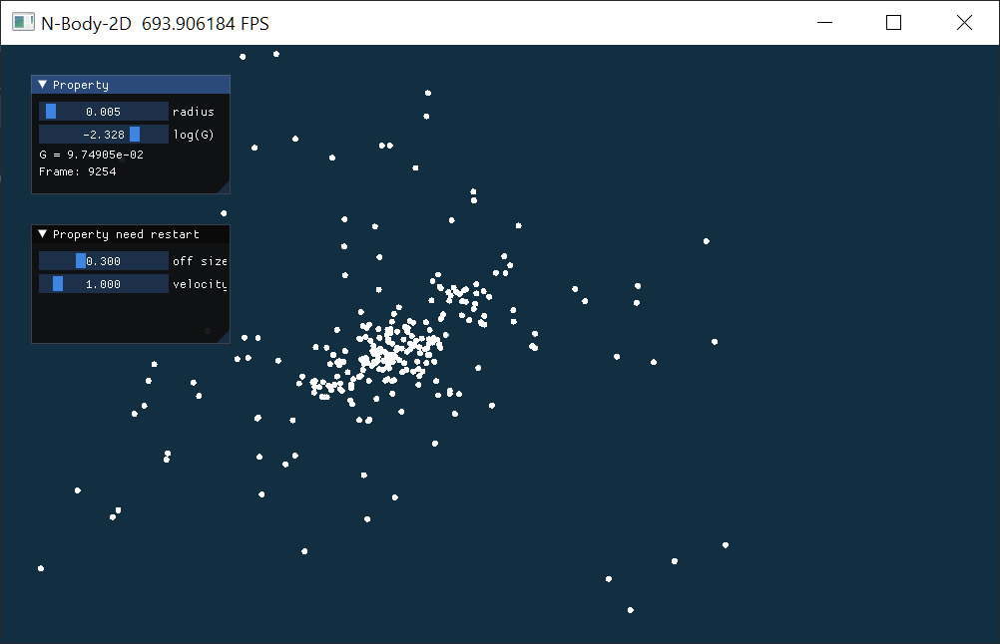
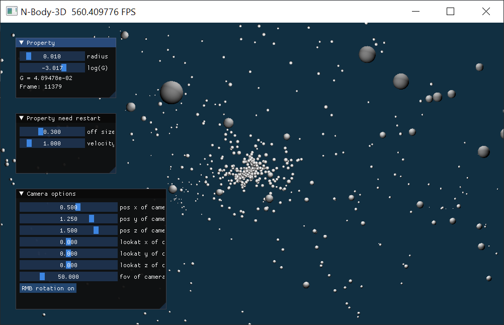

# 太极图形课S1-一个简单的2/3D N-Body 系统
小作业暂定为实现一个 简单的、维度无关的 N-Body 系统！

## 背景简介
想要好玩好看！

**目标**
1. 学习Taichi基本语法
2. 熟悉GGUI的使用
3. 练习面向对象编程

**阶段性目标**
1. 创建一个维度无关的pos和pos_center，在中心点周围随机生成所有的pos坐标值 √
2. 创建一个2d的N-body系统，实现2d的计算和GGUI显示 √
3. 创建一个2d系统，加入鼠标点击后创建一团新星团的功能 ×放弃，无法实现2、3维统一，不如不加
4. 改造为2d面向对象程序 √
5. 实现3d计算，应该只需要拓展计算初速度程序的2d至3d了 √ 暂时使用vel.z=0的处理计算3d初速度
6. 实现3d的GGUI渲染 √
7. 3d场景实现交互添加新星团 ×放弃，不如使用输入框实现
8. 改造为维度无关的面向对象程序（2d或3d自动选择执行，自动选择维度渲染及初始生成位置） √

**已学到的**
1. 屏幕左下角为(0, 0)，+x为-->，+y为↑，+z为垂直屏幕向外
2. GGUI中，鼠标左键点击获取当前坐标，获取的应该是canvas的坐标，数值为[0~1, 0~1]，无论2d还是3d

## 问题
1. Taichi kernel中，若一个field涉及不同维度下的不同长度，无法直接使用if-else通过判断分支使其长度不同。比如`if dim == 2: vel=[0, 0]; elif dim == 3: vel=[0,0,0];`就会报错，在程序中我使用了赋值过程内的if-else解决，但是感觉不是很灵活和漂亮。这是由于kernel编译时，会同时检查所有分支中变量的长度，会出现不一致的情况。这个问题或许需要等到Taichi支持在kernel内部临时定义field才能解决？
2. 3D camera中，track_user_inputs方法改变的只是对当前scene渲染到canvas的图像的camera，并非改变camera的pos和lookat值？本程序中右键拖拽导致的图案变形非常严重，如何改善？

## 成功效果展示
2D 系统：


3D 系统：


## 整体结构
```
-LICENSE
-|img  存储展示图片
-|test  存储参考和试验用的代码
-README.MD
-nbody_ggui.py  面向对象2d程序：
-CelestialObject.py  面向对象类文件
```

## 运行方式

首先修改`nbody_ggui.py`中`## def parameters`部分的案例数值，之后运行程序即可。
`python3 nbody_ggui.py`

面板窗口说明：
1. Property面板，数值修改后实时生效
   1. radius为星体半径
   2. log(G)为万有引力常量数值的对数
2. Property needs restart面板，数值修改后重置生效
   1. off size为初始随机生成方形/立方体星团时的长度
   2. velocity 0为初始速度大小
3. Camera options面板，数值修改后实时生效
   1. pos xyz为camera的三维位置
   2. lookat xyz为camera的视向lookat(lookat怎么翻译？)
   3. fov(是什么？)
   4. RMB rotation on/off，点击后开启/关闭右键旋转camera，旋转状态不保存，即在关闭后会返回开启前的camera状态

快捷键说明：
1. SPACE：开始/暂停运行
2. r：初始化重置所有星体
3. c：初始化重置3D系统中的camera
4. ESC：退出
